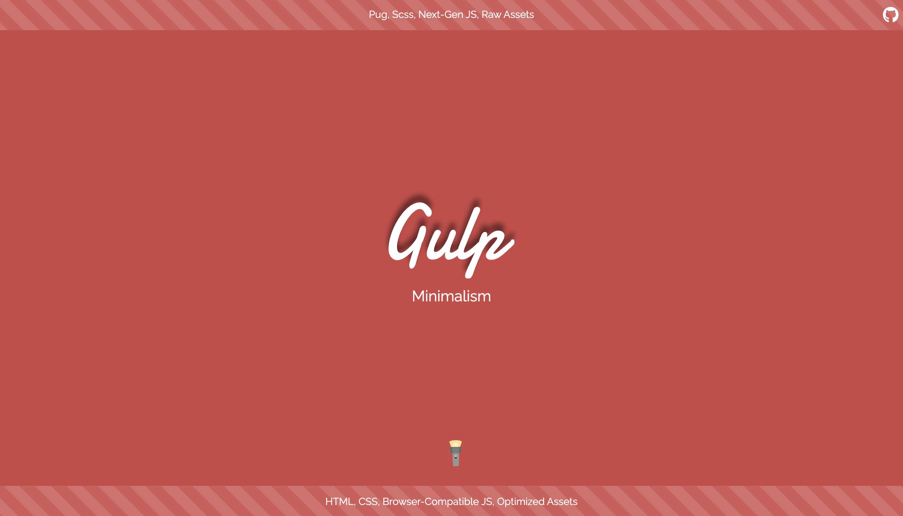

# Super gulp



🚀 [Deploy Site](https://jinyongp.dev/super-gulp/)

Learn Gulp by building an awesome development environment

## Scripts

- `yarn`: Install dependencies
- `yarn dev`: Start live server for development
- `yarn build`: Build this project
- `yarn deploy`: Deploy this project

## Learning Gulp

### Scaffolding

[Gulp](https://gulpjs.com/)를 학습하기 위해 일반적인 개발 환경을 구성했습니다. Pug, SCSS 그리고 최신 JS 문법을 사용하는 환경에서 브라우저에서 구동될 수 있도록 gulp로 빌드하는 게 목적입니다.

```
.
├── .gitignore
├── README.md
├── package.json
├── yarn.lock
└── src
    ├── index.pug
    ├── img
    │   └── logo.png
    ├── js
    │   ├── main.js
    │   └── util.js
    ├── partials
    │   ├── footer.pug
    │   └── header.pug
    ├── scss
    │   ├── _reset.scss
    │   ├── _variables.scss
    │   └── style.scss
    └── templates
        └── layout.pug
```

### Configuring Babel for Gulp

`gulp` 모듈을 설치하고 `gulp` 명령어를 실행하기 위해서 `package.json`의 `scripts`를 추가해주었습니다.

```json
{
  "scripts": {
    "dev": "gulp dev",
    "build": "gulp build"
  },
}
```

`gulp` 명령어를 실행하기 위해선 추가로 [`gulpfile.js` 파일](https://gulpjs.com/docs/en/getting-started/javascript-and-gulpfiles)이 필요합니다. `gulpfile.js`에서 `import/export` 문법을 사용하기 위해 [babel](https://babeljs.io/)을 설치합니다.

```sh
$ yarn add -D @babel/core @babel/register @babel/preset-env
```

그리고 [`gulpfile.babel.js`](gulpfile.babel.js)로 이름을 변경합니다. 추가로 [`.babelrc`](.babelrc)을 생성합니다. 이로써, `gulpfile`에서 최신 JS 문법을 작성할 수 있게 되었습니다.

## Pug Compilation

`scripts`에서 작성한 명령어를 실행하면 `src` 폴더 내에 필요한 파일을 컴파일해야 합니다. `dev` 명령어를 실행하고 싶다면 `gulp.babel.js`에서 `dev`를 `export` 해야합니다.

```js
import gulp from 'gulp';

export const dev = console.log('scripts:dev');
```

그럼 먼저 pug 파일을 컴파일하기 위해 [`gulp-pug`](https://www.npmjs.com/package/gulp-pug)를 설치하고 아래 내용을 작성합니다. 최상위 pug 파일 하나만 빌드합니다.

```js
import pug from 'gulp-pug';

const html = () => gulp.src('src/index.pug').pipe(pug()).pipe(gulp.dest('dist'));

export const dev = gulp.series(html);
```

[`src()`](https://gulpjs.com/docs/en/api/src)는 파일 시스템으로부터 [`globs`](https://gulpjs.com/docs/en/getting-started/explaining-globs/)로 선택한 파일을 읽습니다. 선택한 파일은 `pipe()` 메서드를 연결하여 변형합니다. `pug` 파일을 컴파일하기 위해 `gulp-pug`를 연결합니다. 컴파일한 결과를 [`dest()`](https://gulpjs.com/docs/en/api/dest)로 원하는 폴더에 저장합니다.

다시 빌드가 필요할 때 `dist` 폴더를 삭제하려면 [`del`](https://www.npmjs.com/package/del) 모듈을 설치하고 아래 내용을 추가합니다.

```js
import del from 'del';

const clean = () => del('dist');

export const dev = gulp.series(
  gulp.parallel(clean),
  gulp.parallel(html),
);
```

역할에 따라 단계를 나누기 위해 [`parallel()`](https://gulpjs.com/docs/en/api/parallel) 메서드로 순서를 구분했습니다.

## Webserver and Watching Files

빌드 결과물을 실행하기 위해 [`gulp-webserver`](https://www.npmjs.com/package/gulp-webserver)를 설치하고 `gulpfile`에 추가합니다.

```js
import webserver from 'gulp-webserver';

const ws = () => gulp.src('dist').pipe(webserver({ livereload: true }));

export const dev = gulp.series(
  gulp.parallel(clean),
  gulp.parallel(html),
  gulp.parallel(ws),
);
```

`dev` 명령어를 통해 서버를 실행할 수 있습니다.

파일 내용을 변경했을 때 알아서 빌드하고 서버를 재시작할 수 있도록 [`watch()`](https://gulpjs.com/docs/en/api/watch) 메서드를 이용합니다.

```js
const watch = () => gulp.watch('src/**/*.pug', html);

export const dev = gulp.series(
  gulp.parallel(clean),
  gulp.parallel(html),
  gulp.parallel(ws, watch),
);
```

`src` 폴더 내 모든 `pug` 파일에 대해 변경사항이 발생한다면 `pug`를 다시 실행하여 빌드합니다.

## Image Optimization

[`gulp-image`](https://www.npmjs.com/package/gulp-image) 모듈로 최적화한 이미지를 빌드에 전달할 수 있습니다.

```js
import image from 'gulp-image';

const img = () => gulp.src('src/img/*').pipe(image()).pipe(gulp.dest('dist/img'));

export const dev = gulp.series(
  gulp.parallel(clean),
  gulp.parallel(html, img),
  gulp.parallel(ws, watch),
);
```

## SCSS Compilation

SCSS를 빌드하기 위해 [`gulp-sass`](https://www.npmjs.com/package/gulp-sass)(추가로 `sass`도)를 설치하고 아래 내용을 추가합니다.

```js
import dartSass from 'sass';
import gulpSass from 'gulp-sass';

const sass = gulpSass(dartSass);

const css = () =>
  gulp
    .src('src/scss/style.scss')
    .pipe(sass().on('error', sass.logError))
    .pipe(gulp.dest('dist/css'));

const watch = () => {
  gulp.watch('src/**/*.scss', css);
};

export const dev = gulp.series(
  gulp.parallel(clean),
  gulp.parallel(html, css, img),
  gulp.parallel(ws, watch),
);
```

SCSS 파일의 변경사항도 추적하기 위해 `watch`에 추가해둡니다.

CSS에 대해 브라우저 호환성을 높이기 위해 [`gulp-autoprefixer`](https://www.npmjs.com/package/gulp-autoprefixer)를 추가합니다. 동시에 CSS 파일 압축을 위해 [`gulp-csso`](https://www.npmjs.com/package/gulp-csso)를 설치하고 아래 내용을 추가합니다.

```js
import autoprefixer from 'gulp-autoprefixer';
import csso from 'gulp-csso';

const css = () =>
  gulp
    .src('src/scss/style.scss')
    .pipe(sass().on('error', sass.logError))
    .pipe(autoprefixer())
    .pipe(csso())
    .pipe(gulp.dest('dist/css'));
```

autoprefixer는 [`browserslist`](https://github.com/browserslist/browserslist)를 지원합니다. [이 중 하나를 선택](https://github.com/browserslist/browserslist#full-list)하고 [`.browserslistrc`](.browserslistrc) 파일에 작성하여 지원 범위를 선택할 수 있습니다.

## Babel Support

`import/export` 문법과 더불어 최신 JS 문법에 대해 브라우저 호환성을 높이기 위해서 [`gulp-bro`](https://www.npmjs.com/package/gulp-bro), [`babelify`](https://www.npmjs.com/package/babelify), [`uglifyify`](https://www.npmjs.com/package/uglifyify)를 설치하고 다음 내용을 추가합니다.

```js
import browserify from 'gulp-bro';
import babelify from 'babelify';

const js = () =>
  gulp
    .src('src/js/main.js')
    .pipe(
      browserify({
        debug: process.env.NODE_ENV === 'development',
        transform: [
          babelify.configure({ presets: ['@babel/preset-env'] }),
          ['uglifyify', { global: true }],
        ],
      }),
    )
    .pipe(gulp.dest('dist/js'));

const watch = () => {
  gulp.watch('src/**/*.js', js);
};

export const dev = gulp.series(
  gulp.parallel(clean),
  gulp.parallel(html, css, js, img),
  gulp.parallel(ws, watch),
);
```

- [`browserify`](https://browserify.org/)는 브라우저가 `require` 문법을 이해할 수 있도록 합니다.
- [`babelify`](https://github.com/babel/babelify)는 `browserify`용 transform으로 최신 JS 문법이 대부분의 브라우저에 실행 가능하도록 트랜스파일링합니다.
- [`uglifyify`](https://www.npmjs.com/package/uglifyify)는 코드를 압축하여 용량을 줄입니다.

개발 모드일 경우, `debug` 옵션을 추가하여 SourceMap 파일이 생성되도록 하여 개발 환경에서 디버그를 용이하게 합니다.

## Deploying

[`gulp-gh-pages`](https://www.npmjs.com/package/gulp-gh-pages)로 프로젝트를 배포합니다.

```js
import pages from 'gulp-gh-pages';

const clean = () => del(['dist', '.publish']);

const publish = () => gulp.src('dist/**/*').pipe(pages());

const prepare = gulp.parallel(clean);
const assets = gulp.parallel(html, css, js, img);
const live = gulp.parallel(ws, watch);

export const build = gulp.series(prepare, assets);
export const dev = gulp.series(build, live);
export const deploy = gulp.series(build, publish, clean);
```

[`package.json`](package.json)에 `scripts:deploy`를 추가합니다. `gh-pages`로 배포하고 생성된 `dist` 폴더와 `.publish` 폴더를 정리합니다.
